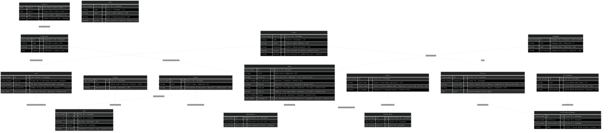

```mermaid
%%{init: {"theme":"dark","fontFamily": "Consolas, monospace","logLevel": "info", "width":"800"}}%%
erDiagram 
    Genre {
        big_integer     id              PK      "Genre's ID | Unsigned"
        string          name                    "Genre's name | Required | 64"
        string          description             "Description of the genre | Optional | Default Null | 255"
    }
          
    Status {
        big_integer     id              PK      "Copy ID | Unsigned"         
        string          code                    "Status code | Required | Default 'AVAIL' | 6" 
        string          description             "Barcode | Nullable | 255"
    }

    Country {
        char            code_2          PK      "Two letter country code | 2"
        char            code_3                  "Three letter country code | 3"
        string          name                    "Genre's name | Required | 64"
        integer         numeric_code            "Numeric country code | Unsigned"
    }
    
    Language {
        big_integer     id                      " Language ID | Unsigned | Autoincrement"
        string          code                    " Language Code | Required | 8"
        string          name                    " Language Name | Required | 128"
        string          description             " Language Description | Optional | 255"
    }

    Loan {
        long_integer    id              PK      "Loan counter | Unsigned"
        long_integer    user_id         FK      "Client who is borrowing the book | Unsigned"
        long_integer    copy_id         FK      "The book (copy) being borrowed | Unsigned"
        small_integer   loan_period             "Number of days loan is for | Default 7 | Unsigned"
        date_time       date_returned           "Date book returned | Optional | Default Null"
    }
    
    
    Author {
        big_integer     id              PK      "Author ID | Unsigned"
        string          given_name              "Author's Given Name (Optional) | 255"
        string          family_name             "Author's Family/Company Name | Required if given name omitted | 255"
        boolean         is_company              "Indicates if corporate author | Default False"
    }
    
    Copy {
        big_integer     id              PK      "Copy ID | Unsigned"         
        big_integer     book_id         FK      "Book ID | Unsigned" 
        string          qr_code                 "QR Code | Nullable | 256"
        big_integer     status                  "Status ID | unsigned"
        boolean         on_loan                 "Indicates if book on loan | Default False"
    }
    
    Book {
        big_integer     id              PK      "Book's ID | Unsigned"
        string          title                   "Book Title | Required | 255"
        string          subtitle                "Book sub-title | Optional | 255 | Default Null"
        small_integer   year_published          "Optional | Unsigned | Default Null"
        integer         edition                 "Optional | unless > 1 | Unsigned | Default Null"
        string          isbn_10                 "ISBN 10 - for older books | Optional | 10 chars | Default Null"
        string          isbn_13                 "ISBN 13 - for newer books | Optional | 13 chars | Default Null"
        small_integer   height                  "Of book in mm | Optional | Unsigned | Default Null"
        big_integer     language_id     FK      "The language the book is written in | Unsigned | Optional | Default Null"
    }
    
    Publisher {
        big_integer     id              PK      "Publisher's ID | Unsigned"
        string          name                    "Publisher's name | 255"
        string          city                    "Publisher's city | 128"
        char            country         FK      "Publisher's country code | 2"
    }
    
    Client {
        long_integer    user_id         PK      "Client ID | Unsigned"
        string          name                    "Client's 'nickname' | 24"
        string          email                   "Client's email address | 255"
        string          password                "Client's Hashed password | 255"  
        boolean         active                  "Client account is active | Default false"  
        string          barcode                 "Client barcode for membership card | Required | 32"
    }
    
    Profile {
        long_integer    id              PK      "Profile ID | Unsigned"
        long_integer    client_id       FK      "Client ID | Unsigned"
        string          given_name              "Client's given (first) name(s) | Required if family_name empty | 255"
        string          family_name             "Client's family (last) name(s) | Optional | 255"
        text            photo                   "Base64 Encoded Profile Image"
    }
    
    SocialMedia {
        long_integer    id              PK      "User ID | Unsigned"
        string          name                    "Social Media Short Name | 24"
        string          url                     "Social Media account base URL | 255"
        string          description             "Social Media Description | Optional | 255"
    }
    
    ProfileSocialMedia {
        long_integer    id              PK      "Client ID | Unsigned"
        long_integer    profile_id      FK      "Client ID | Unsigned"
        long_integer    social_media_id FK      "Client ID | Unsigned"        
        string          name                    "Client's social media account nickname | 64"
    }


    Book_Genre {
        big_integer     id              PK      "Book-Genre ID | Unsigned"
        big_integer     book_id         FK      "Book which has the Genre | Unsigned"
        big_integer     genre_id        FK      "Genre applied to Book | Unsigned"
    }
        
    Author_Book {
        big_integer     id              PK      "Author-Book ID | Unsigned"         
        big_integer     author_id       FK      "Author ID | Unsigned" 
        big_integer     book_id         FK      "Book ID | Unsigned" 
    }
  

    User {
        long_integer    user_id         PK      "User ID | Unsigned"
        string          name                    "User's 'nickname' | 24"
        string          email                   "User's email address | 255"
        string          password                "User's Hashed password | 255"  
        boolean         active                  "User account is active | Default false"  
    }
    
    Profile     ||--o{ ProfileSocialMedia : has_zero_or_more
    SocialMedia ||--o{ ProfileSocialMedia : has_zero_or_more
    Loan        }o--|| Copy               : is_borrowed_by_zero_or_more 
    Client      ||--o{ Loan               : makes_zero_or_more
    Client      ||--|| Profile            : has_a
    Book        ||--o{ Copy               : has_zero_or_more
    Status      ||--o{ Copy               : has_zero_or_more      
    Publisher   ||--o{ Book               : publishes_zero_or_more       
    Country     ||--o{ Publisher          : has_zero_or_more       
    Genre       ||--o{ Book_Genre         : classifies_zero_or_more
    Book        ||--o{ Book_Genre         : has_zero_or_more
    Book        ||--o{ Author_Book        : written_by_one_or_more
    Language    ||--o{ Book               : has_one_or_more
    Author      ||--o{ Author_Book        : writes_zero_or_more 
```
